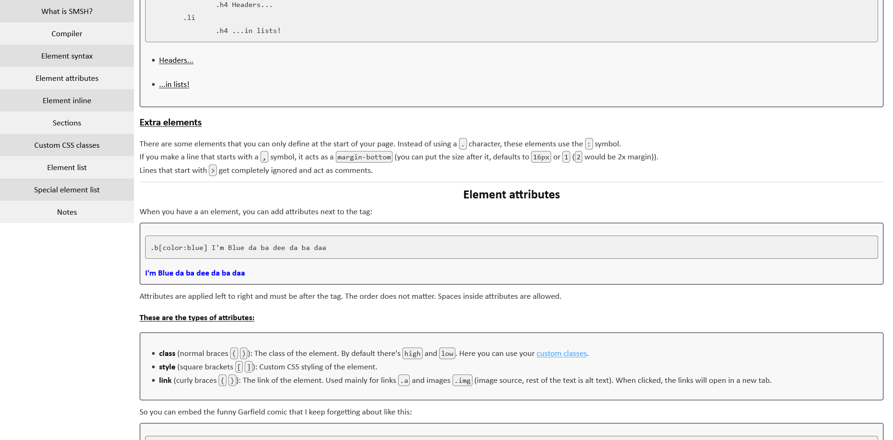
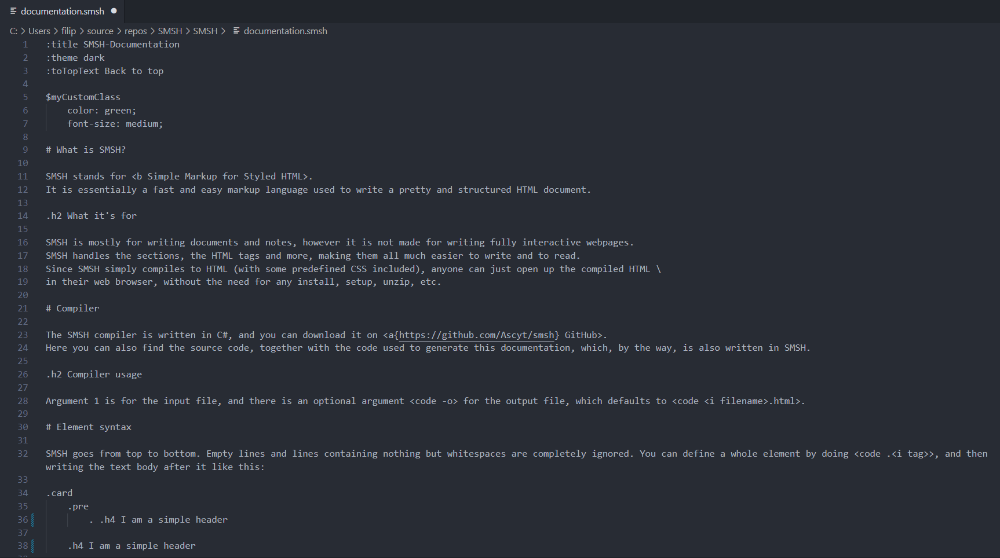

Open SMSH/index.html or visit <a href="https://ascyt.com/projects/smsh" target="_blank">https://ascyt.com/projects/smsh</a> for the documentation.

## Screenshots
#### Dark theme

#### Light theme

#### Code

